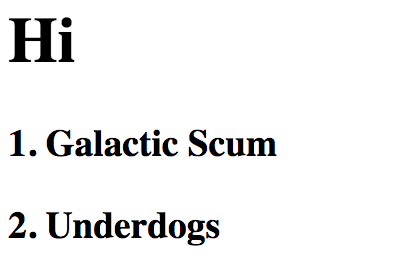

# Javascript Fucntions

This project is an exploration of javaScript functions. I built an animal nuggeitizer. I also printed some numbers to the DOM. 

## Screenshots 


## How to run this project
* Use npm to install http-server in your terminal: 
```sh
npm install -g http-server 
```
* Run the server 
```sh 
hs -p 9999
```
* Open chrome and navigate to: 
```
localhost: 9999
```

